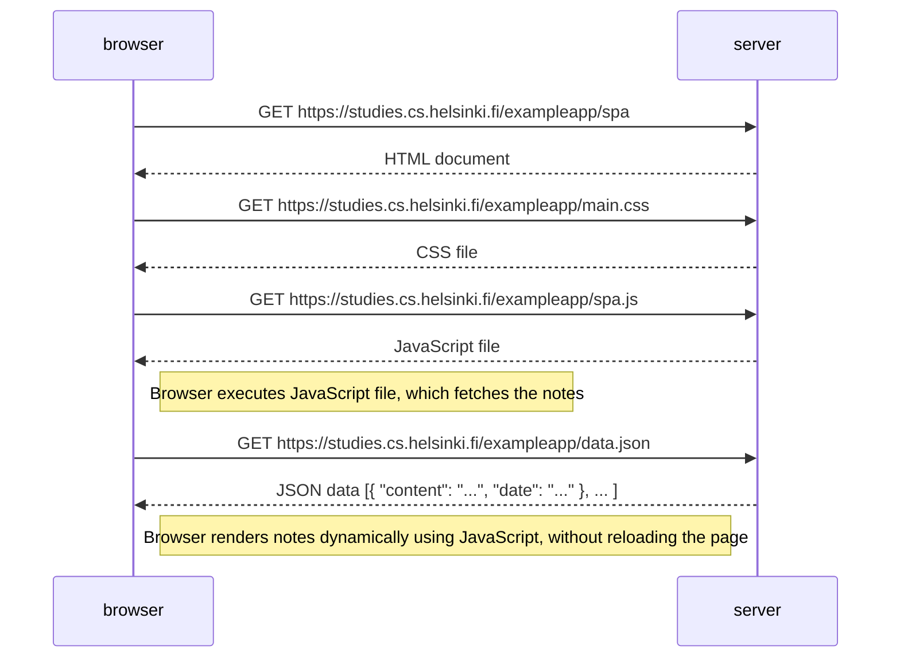

```mermaid
sequenceDiagram
    participant browser
    participant server

    browser->>server: GET https://studies.cs.helsinki.fi/exampleapp/spa
    server-->>browser: HTML document 

    browser->>server: GET https://studies.cs.helsinki.fi/exampleapp/main.css
    server-->>browser: CSS file

    browser->>server: GET https://studies.cs.helsinki.fi/exampleapp/spa.js
    server-->>browser: JavaScript file

    Note right of browser: Browser executes JavaScript file, which fetches the notes

    browser->>server: GET https://studies.cs.helsinki.fi/exampleapp/data.json
    server-->>browser: JSON data [{ "content": "...", "date": "..." }, ... ]

    Note right of browser: Browser renders notes dynamically using JavaScript, without reloading the page
```