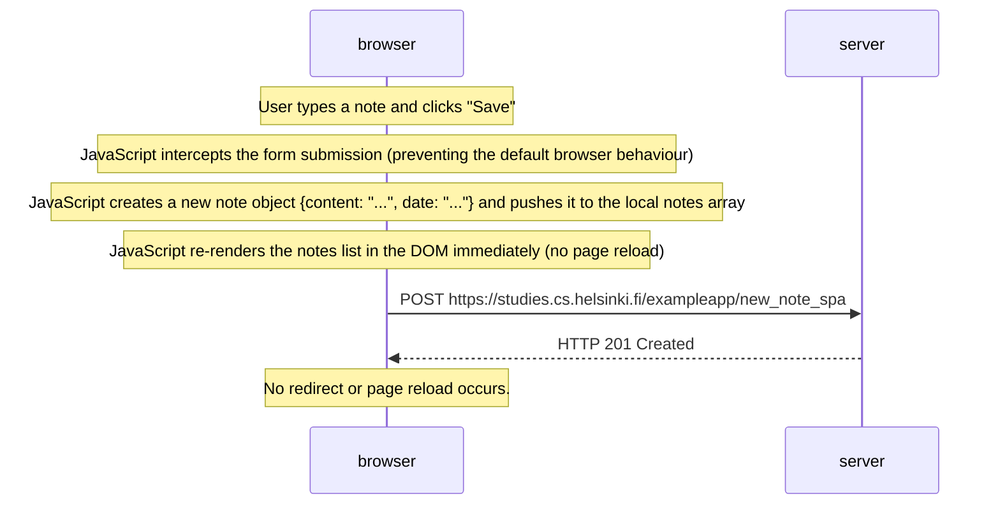

```mermaid
sequenceDiagram
    participant browser
    participant server

    Note over browser: User types a note and clicks "Save"

    Note over browser: JavaScript intercepts the form submission (preventing the default browser behaviour)

    Note over browser: JavaScript creates a new note object {content: "...", date: "..."}  and pushes it to the local notes array

    Note over browser: JavaScript re-renders the notes list in the DOM immediately (no page reload)

    browser->>server: POST https://studies.cs.helsinki.fi/exampleapp/new_note_spa 
    server-->>browser: HTTP 201 Created

    Note over browser: No redirect or page reload occurs.
```