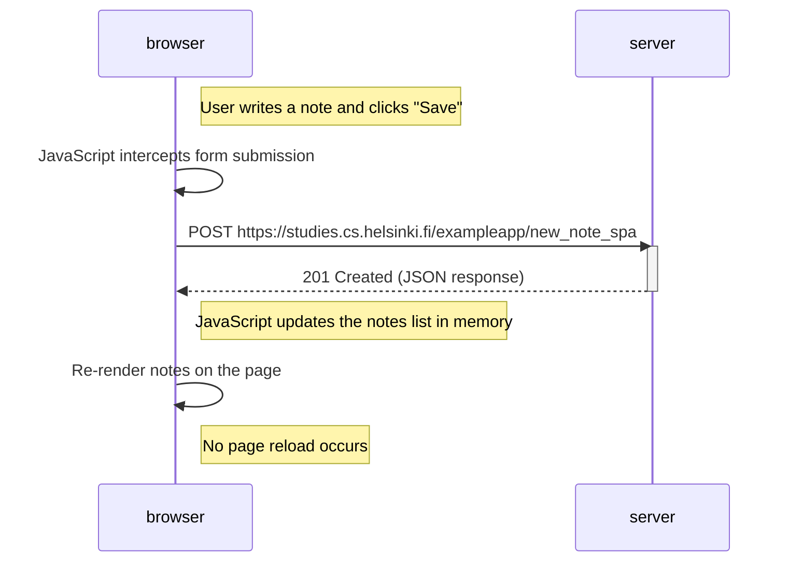

```mermaid
sequenceDiagram
    participant browser
    participant server

    Note right of browser: User writes a note and clicks "Save"

    browser->>browser: JavaScript intercepts form submission
    browser->>server: POST https://studies.cs.helsinki.fi/exampleapp/new_note_spa
    activate server
    server-->>browser: 201 Created (JSON response)
    deactivate server

    Note right of browser: JavaScript updates the notes list in memory

    browser->>browser: Re-render notes on the page
    Note right of browser: No page reload occurs
```