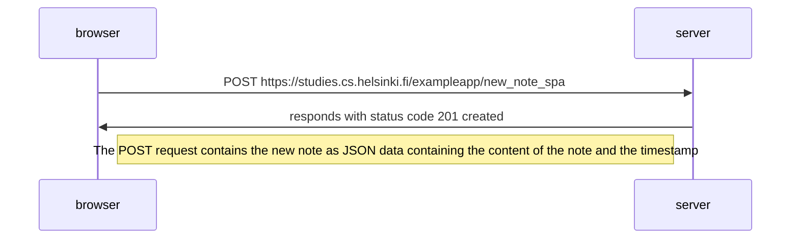

```mermaid
sequenceDiagram
    participant browser
    participant server

    browser->>server: POST https://studies.cs.helsinki.fi/exampleapp/new_note_spa 
    server->>browser: responds with status code 201 created 

    Note right of browser: The POST request contains the new note as JSON data containing  the content of the note and the timestamp
```